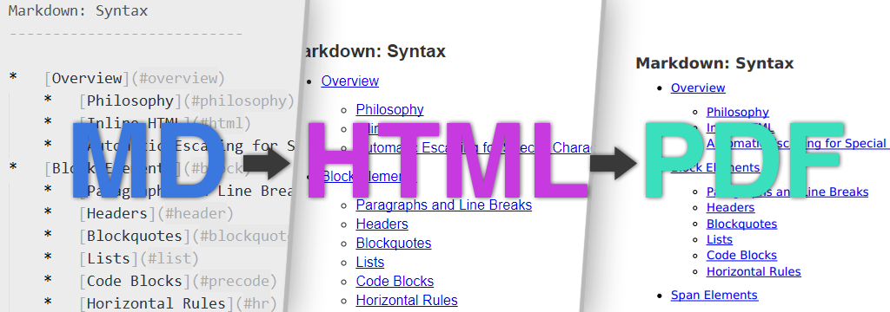

# MD2PDF

Convert markdown files to PDF with flexible template and stylesheet using [wkhtmltopdf](https://wkhtmltopdf.org/).

The app itself does not to much, it just ties together **wkhtmltopdf** (using [blocknotes/wkhtmltopdf-crystal](https://github.com/blocknotes/wkhtmltopdf-crystal)) with [**markd** ](https://github.com/icyleaf/markd) (Crystal CommonMark parser) and [**Crinja**](https://github.com/straight-shoota/crinja) (Crystal template engine).

[**Examples**](https://straight-shoota.github.io/md2pdf/examples)

## Installation

There is currently no binary distribution, you'll need to build it yourself.

### Building instructions

* install [Crystal](https://crystal-lang.com)
* install [libwkhtmltox](https://wkhtmltopdf.org/libwkhtmltox/)
  For Ubuntu trusty:
  * `sudo apt-get install xfonts-75dpi`
  * `wget https://github.com/wkhtmltopdf/wkhtmltopdf/releases/download/0.12.2.1/wkhtmltox-0.12.2.1_linux-trusty-amd64.deb`
  * `sudo dpkg -i wkhtmltox-0.12.2.1_linux-trusty-amd64.deb`
  * `sudo ldconfig`
* download [MD2PDF repository](https://github.com/straight-shoota/md2pdf/fork)
* run `shards build`
* now the executable is available in `bin/md2pdf`

## Usage

The programm is usually run as `md2pdf myfile.md` which will generate a PDF at `myfile.pdf`.

## Contributing

1. Fork it ( https://github.com/straight-shoota/md2pdf/fork )
2. Create your feature branch (git checkout -b my-new-feature)
3. Commit your changes (git commit -am 'Add some feature')
4. Push to the branch (git push origin my-new-feature)
5. Create a new Pull Request

## Contributors

- [straight-shoota](https://github.com/straight-shoota) Johannes Müller - creator, maintainer
